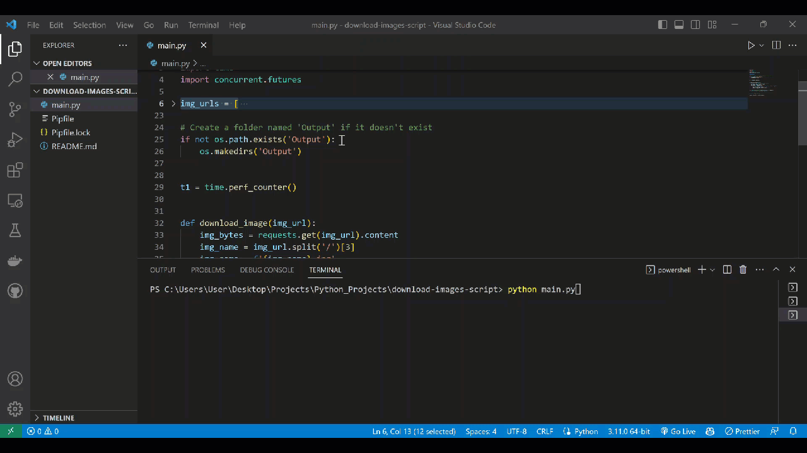

# Download a list of photo's via their URL's

> This is a simple script that downloads a list of photo's via their URL's. It uses the requests library to download the photo's and the concurrent.futures library to download the photo's in parallel.




## Usage

#
1: Install the dependencies:

```bash
pipenv install -r requirements.txt 
```

#
2: Run server:

```bash
python main.py
```